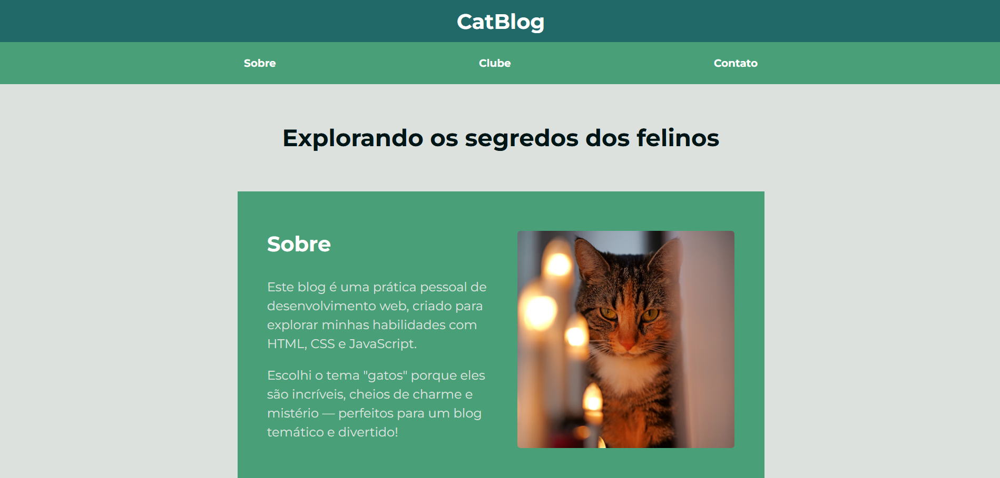

# 🐾 CatBlog

CatBlog is a project developed to practice HTML, CSS, and Flexbox, inspired by the [Origamid FlexBlog course](https://www.origamid.com/curso/css-flexbox/).  
The site explores the feline universe with sections on Mysteries, Playtime, Curiosities, and even a Cat Club!

---

## ✨ Goal

- Practice **Flexbox** in a real project, following the FlexBlog lesson from Origamid.
- Build a **responsive and modern layout** that works on both mobile and larger screens.

---

## 🚀 Technologies Used

- HTML5
- CSS3
- Flexbox for responsive layout
- Google Fonts
- Material Symbols (Google Icons)

---

## 🖼️ Screenshots

### Layout Preview

  

---

## 🔗 Access the Live Project

[CatBlog Live](https://pazedev.github.io/CatBlog/)

---

## 📬 Contact

💌 Email: pazedev@gmail.com
